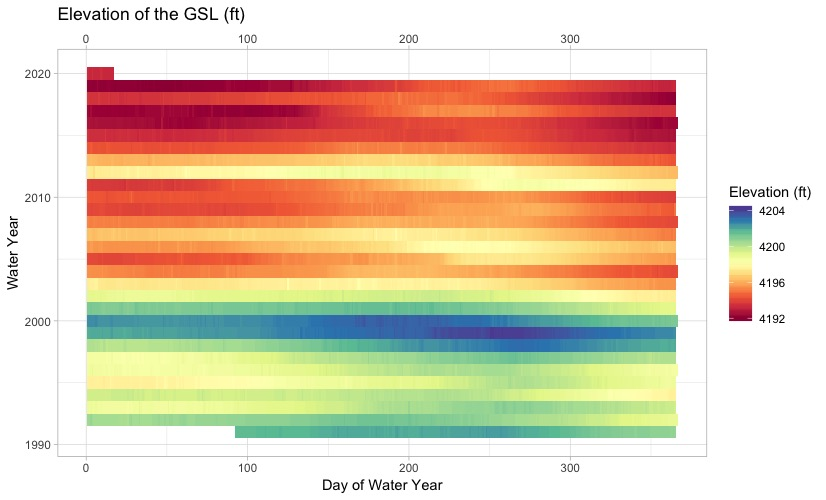

# Great Salt Lake Elevations

After attending AGU, I wanted to examine a more visually compelling and dynamic method for displaying discharge data from a stream, namely a heatmap.

There's a great test case for this on a natural system close to where I live: The Great Salt Lake.

I first pulled the USGS elevation data for the Great Salt Lake and trimmed it to the last 30 years, I then used GGplot in R to make a nice visual representation of the lake elevations.

Compare a simple line plot:

To the much more informative heatmap:

