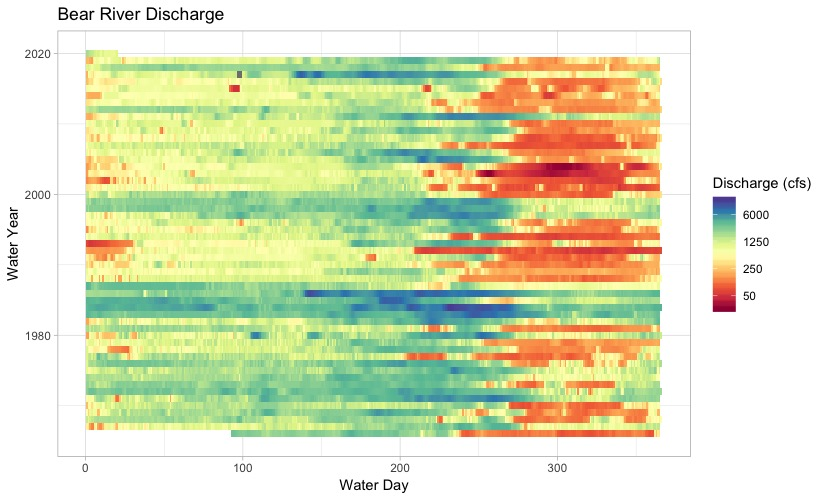

# Great Salt Lake Elevations

After attending AGU, I wanted to examine a more visually compelling and dynamic method for displaying discharge data from a stream, namely a heatmap.

There's a great test case for this on a natural system close to where I live: The Great Salt Lake.

I first pulled the USGS elevation data for the Great Salt Lake and trimmed it to the last 30 years, I then used GGplot in R to make a nice visual representation of the lake elevations.

Compare a simple line plot:

To the much more informative heatmap:

One of the major rivers that supplies water to the Great Salt Lake is the Bear River. I decided to apply the same visualization to the Bear River's discharge. This had some complexity as I had to build in a logarithmic color scale. GGplot to the rescue.

I have more discussion on this topic on my [blog](https://matthewmorriss.weebly.com/codeblog/discharge-visualized-thru-heatmap)
